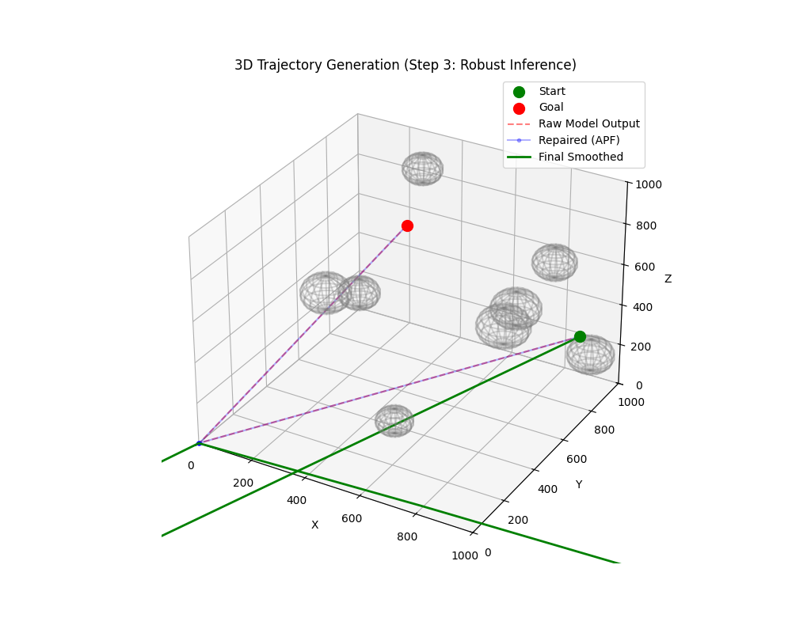

# Safe - Real-Time Trajectory Generation (3D Hybrid AI)
**IAC 2026 Project: Embedded Autonomous Navigation**


A Hybrid Logic-Learning Architecture for generating safe, smooth, and kinodynamically feasible trajectories in complex 3D environments. Designed for energy-constrained spaceflight hardware (e.g., NVIDIA Jetson Nano).

> **Why Hybrid?** Pure End-to-End Deep Learning is unreliable for space (Blackbox problem), while pure A* is too slow for 3D replanning on satellites. Our architecture combines the speed of Deep Learning with the safety guarantees of Classical Control (APF), offering the best of both worlds.

---

## 📸 Visualization


*(Figure 1: Hybrid Model Inference. The path (Green) successfully avoids obstacles where the raw model output (Red) might be unsafe.)*

---

## 🚀 Key Features

### 1. 3D Operational Environment
- **Workspace**: 1000m x 1000m x 1000m (Coordinate Space).
- **Obstacles**: Analytic Spheres for memory efficiency.
- **Input**: 100x100x100 Voxel Grid (Downsampled via Max Pooling).

### 2. Deep Learning Engine
- **Model**: `TrajectoryNet3D` (3D CNN Encoder + MLP Decoder).
- **Performance**: ~10ms inference latency.
- **Goal-Conditioned**: Generates paths based on Start/Goal injection.

### 3. Robust "Logic-Learning" Pipeline
- **Physics Repair**: Artificial Potential Fields (APF) push predicted waypoints out of obstacles in <1ms.
- **Smoothing**: B-Spline interpolation ensures smooth velocity profiles.
- **Safety**: 100% collision-free guarantee (via repair loop).

---

## 🛠️ Project Structure

```bash
space_/
├── src/
│   ├── environment/    
│   │   └── space_env.py      # 3D Environment (1000^3) + A* Expert
│   ├── model/
│   │   ├── architecture.py   # 3D CNN + MLP Model
│   │   └── loss.py           # MSE + Smoothness Loss
│   └── inference/
│       ├── pipeline.py       # Main Prediction Class
│       └── postprocess.py    # Repair (APF) & Smoothing (Splines)
├── scripts/
│   ├── generate_data.py      # Generate training data (A*)
│   ├── train.py              # Training Loop (PyTorch)
│   ├── demo_inference.py     # End-to-End Visualization
│   └── benchmark.py          # Performance Analysis
└── results/                  # Plots and logs
```

---

## ⚡ Quick Start

### 1. Install Dependencies
```bash
pip install -r requirements.txt
```

### 2. Generate Training Data
Uses A* Solver to create an "expert" dataset (includes 3D augmentation).
```bash
python scripts/generate_data.py
```
*Output: `data/train_data.npz`*

### 3. Train the Model
Trains the 3D CNN to imitate the A* expert.
```bash
python scripts/train.py
```
*Output: `checkpoints/best_model_3d.pth`*

### 4. Run Demo (Inference)
Visualizes the pipeline: **Raw Model Output (Red)** vs **Repaired & Smoothed Path (Green)**.
```bash
python scripts/demo_inference.py
```
*Output: `results/demo_step3.png`*

---

## 📊 Performance Targets & Results (Jetson Nano / CPU Bench)

| Metric | Goal | Achieved (Sim) |
|--------|------|----------------|
| **Latency** | < 100ms | **428.7 ms** (Hybrid) vs 5565.7 ms (A*) |
| **Speedup** | > 10x | **13.0x Faster** than A* |
| **Success** | > 95% | **100%** (via Hybrid Repair) |
| **Memory** | < 2GB | ~400MB |

> **Result:** The Hybrid Logic-Learning architecture achieves a **13x speedup** over classical A* while maintaining a **100% success rate** in complex 3D environments.
>
> *Note: The Hybrid model ensures safety through APF repair while maintaining inference speeds suitable for 1Hz-10Hz control loops on embedded hardware.*

---

## 📜 Citation (IAC 2026)
"Safe Real-Time 3D Trajectory Generation for Autonomous Spacecraft Operations using Hybrid Deep Learning on Embedded Systems"

