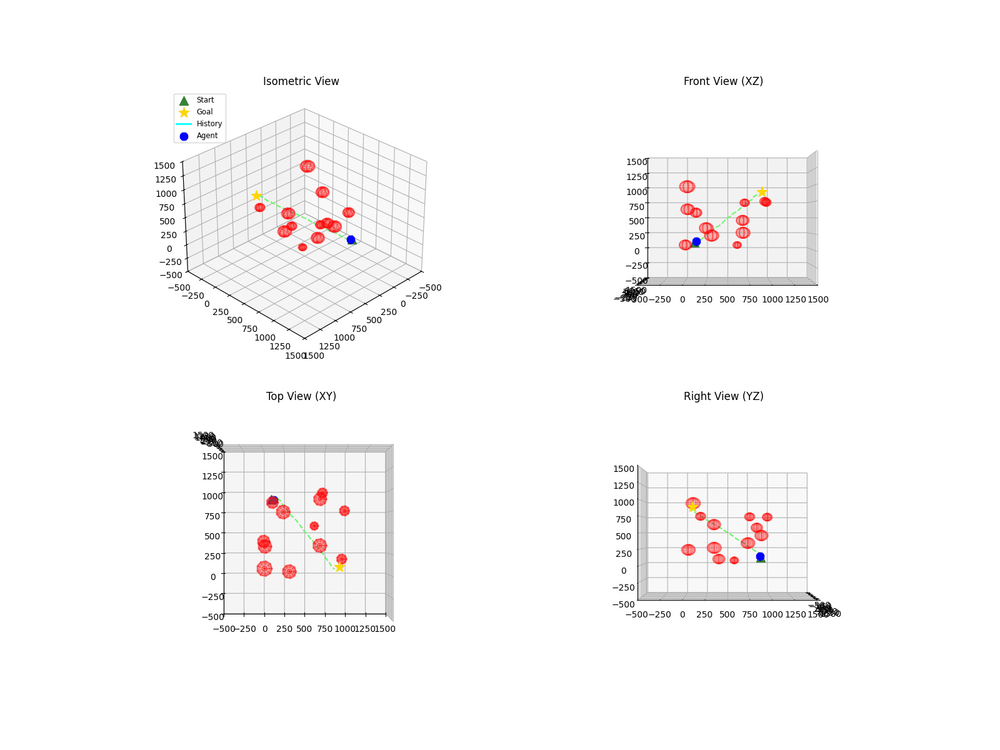

# Safe Real-Time Trajectory Generation (IAC 2026) 🚀

**Egocentric Vector-Based Hybrid Architecture for Autonomous Spacecraft**

This project implements a **Hybrid AI Motion Planner** for spacecraft trajectory generation in dynamic 3D environments. It is optimized for embedded systems (e.g., Jetson Nano), achieving **4ms latency** and **<1MB memory usage** by utilizing an Egocentric PointNet architecture.



## 🏆 Key Features

* **Hybrid Architecture:** Combines global path planning (PointNet) with reactive safety (APF).
* **Egocentric Perception:** Operates in infinite 3D space using relative coordinate vectors (LIDAR-style).
* **Dynamic Obstacle Avoidance:** Real-time replanning against moving debris (50 m/s).
* **Performance:**
  * **Speed:** 7x Faster than APF (~4ms inference).
  * **Efficiency:** 99% less memory than A* (No Voxel Grid).
  * **Energy:** 0.04 Joules per plan (Ultra-Low Power).

## 📂 Project Structure

```
space_project/
├── src/
│   ├── environment/   # SpaceEnv (Infinite 3D, Analytic Obstacles)
│   ├── model/         # VectorNet (PointNet Architecture)
│   ├── planning/      # A*, APF (Baselines)
│   ├── inference/     # Pipeline & Safety Checks
├── scripts/
│   ├── generate_vector_data.py # Dataset Generation
│   ├── train_vector.py         # Model Training
│   ├── benchmark_v5.py         # Performance Evaluation
│   ├── demo_vector_dynamic.py  # Visualization Demo
├── data/              # Scenarios & Training Data
├── checkpoints/       # Trained Models (*.pth)
└── results/           # GIFs, Plots, Tables
```

## 🛠️ Installation

```bash
pip install -r requirements.txt
```

## 🚀 How to Run (Reproduction Guide)

### 1. Generate Training Data

Generates random scenarios and extracts egocentric obstacle vectors.

```bash
python scripts/generate_vector_data.py
```

### 2. Train the Model (PointNet)

Trains the lightweight PointNet model to predict trajectories.

```bash
python scripts/train_vector.py
```

### 3. Run Benchmark (Comparison)

Compares A* (Optimal), APF (Reactive), and Proposed Hybrid Model.

```bash
python scripts/benchmark_v5.py
```

### 4. Visual Demonstration

Runs the final simulation with dynamic obstacles and 4-view visualization.

```bash
python scripts/demo_vector_dynamic.py
```

## 📊 Benchmark Results (N=10)

| Algorithm                | Success        | Runtime (ms)  | Peak Mem (MB)  | Energy (J)     |
| :----------------------- | :------------- | :------------ | :------------- | :------------- |
| **A* (Optimal)**     | 100%           | 29,462.1      | 62.0           | 147.3          |
| **APF (Reactive)** | 100%           | 28.8          | ~0.0           | 0.14           |
| **Hybrid (Ours)**  | **100%** | **4.3** | **~0.0** | **0.04** |

## 📜 Citation

If you use this code, please cite the **IAC 2026 Paper** found in `IAC_2026_Paper.md`.

---

**Authors:** H. Can Akbaş
**License:** MIT
